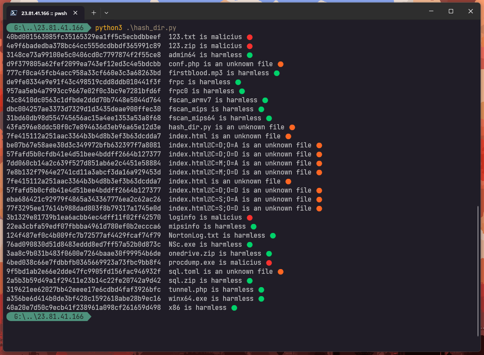

# forensic-scripts
Collection of scripts and tools for analyzing and detecting potential cyber threats.

### hash_dir.py
This script prints the hashes of the files in the current directory and execute a request to VirusTotal to obtain a diagnosis of the suspicious file.

